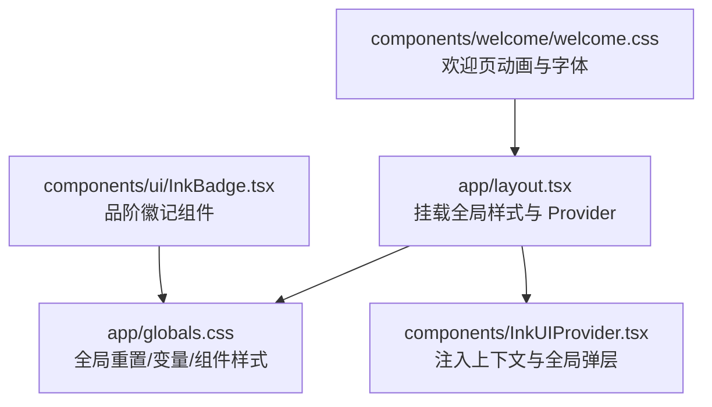
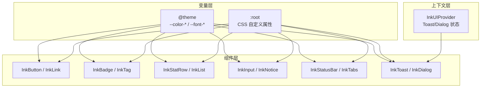
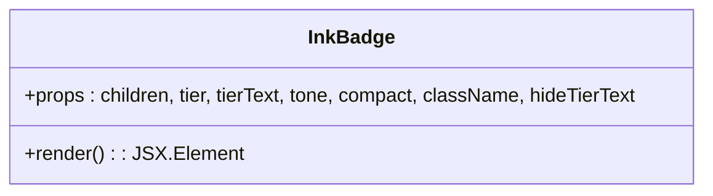
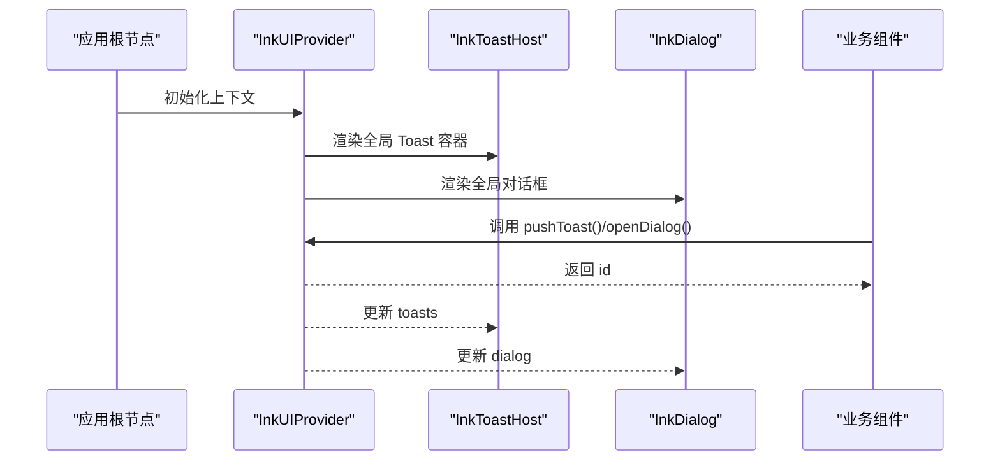
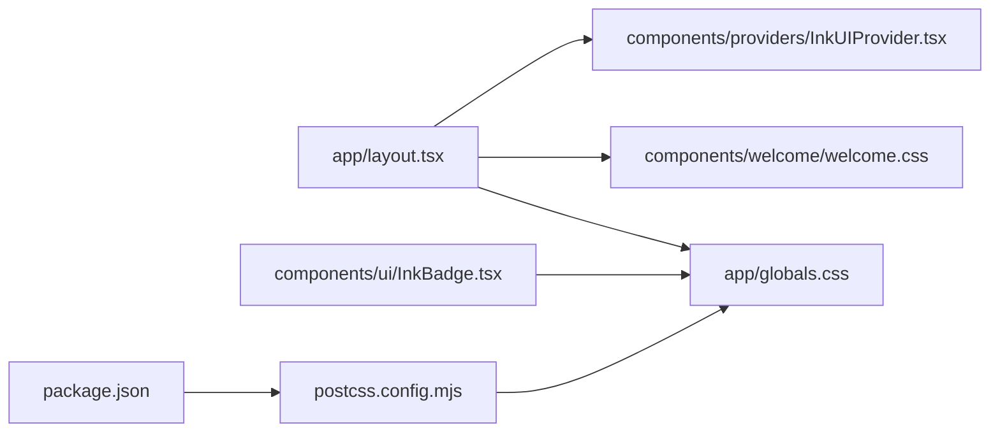

# 样式规范

<cite>
**本文引用的文件**
- [app/globals.css](file://app/globals.css)
- [components/welcome/welcome.css](file://components/welcome/welcome.css)
- [components/ui/InkBadge.tsx](file://components/ui/InkBadge.tsx)
- [components/providers/InkUIProvider.tsx](file://components/providers/InkUIProvider.tsx)
- [components/ui/InkButton.tsx](file://components/ui/InkButton.tsx)
- [components/ui/InkTag.tsx](file://components/ui/InkTag.tsx)
- [types/constants.ts](file://types/constants.ts)
</cite>

## 更新摘要
**变更内容**
- 更新了全局样式系统，引入新的CSS变量用于品阶颜色和字体
- 重构了组件样式以支持新的原子化UI组件
- 更新了InkBadge组件对品阶颜色的映射逻辑
- 新增了品阶颜色变量在主题系统中的定义

## 目录
1. [引言](#引言)
2. [项目结构](#项目结构)
3. [核心组件](#核心组件)
4. [架构总览](#架构总览)
5. [详细组件分析](#详细组件分析)
6. [依赖关系分析](#依赖关系分析)
7. [性能考量](#性能考量)
8. [故障排查指南](#故障排查指南)
9. [结论](#结论)
10. [附录](#附录)

## 引言
本文件聚焦于样式系统的设计与实现，重点说明以下方面：
- Tailwind CSS 与自定义 CSS 的协同工作模式
- globals.css 中的全局样式重置与修仙主题变量
- welcome.css 中的特定动画与字体样式
- InkComponents.tsx 如何通过 Tailwind 实用类与自定义 ink-* 类名构建一致的视觉语言
- InkUIProvider 如何注入主题配置与动态样式上下文
- CSS 变量在主题切换中的应用方式
- 通过 BEM 或类似命名规范避免样式冲突
- 组件样式扩展与定制指南，确保新功能保持视觉统一性

## 项目结构
样式体系由三层构成：
- 应用级全局样式：app/globals.css 定义字体、颜色、间距、基础组件样式与响应式规则
- 主题与变量：通过 CSS 自定义属性与 @theme 声明集中管理主题变量
- 组件级样式：InkComponents.tsx 通过组合 ink-* 类名与 Tailwind 实用类实现一致风格；InkUIProvider 注入全局交互态（Toast、Dialog）

**图表来源**
- [app/layout.tsx](file://app/layout.tsx#L1-L33)
- [app/globals.css](file://app/globals.css#L1-L162)
- [components/providers/InkUIProvider.tsx](file://components/providers/InkUIProvider.tsx#L1-L82)
- [components/ui/InkBadge.tsx](file://components/ui/InkBadge.tsx#L1-L111)
- [components/welcome/welcome.css](file://components/welcome/welcome.css#L1-L155)

## 核心组件
- 全局样式与主题变量
  - 在 app/globals.css 中使用 @theme 声明主题变量，并在 :root 中提供 CSS 自定义属性，使 Tailwind 与自定义类共享同一套设计令牌
  - 通过 --color-*、--font-*、--ink-gap-*、--ink-radius-* 等变量统一色彩、字体与间距
  - 新增品阶颜色变量（--color-tier-*）用于统一管理不同品阶的显示颜色
- 文字化组件库
  - InkComponents.tsx 将语义化的组件封装为“文字化”风格，结合 ink-* 类名与 Tailwind 实用类，形成一致的视觉语言
  - 例如 InkButton、InkLink、InkBadge、InkTag、InkStatRow、InkList、InkInput、InkNotice、InkStatusBar、InkToast、InkDialog、InkTabs 等
- 动态样式上下文
  - InkUIProvider.tsx 通过 React Context 管理 Toast 与 Dialog 的全局状态，并在渲染树末尾挂载对应 UI，保证层级与交互一致性

**章节来源**
- [app/globals.css](file://app/globals.css#L1-L162)
- [components/ui/InkBadge.tsx](file://components/ui/InkBadge.tsx#L1-L111)
- [components/providers/InkUIProvider.tsx](file://components/providers/InkUIProvider.tsx#L1-L82)

## 架构总览
样式系统采用“变量驱动 + 组件类名 + Tailwind 实用类”的三层协作：
- 变量层：@theme 与 :root 定义主题变量，供 Tailwind 与自定义类共同消费
- 组件层：InkComponents.tsx 以 ink-* 前缀命名类，配合 Tailwind 实用类，形成稳定的视觉基线
- 上下文层：InkUIProvider.tsx 注入全局交互态，确保 Toast/Dialog 等跨组件的一致性

**图表来源**
- [app/globals.css](file://app/globals.css#L1-L162)
- [components/ui/InkBadge.tsx](file://components/ui/InkBadge.tsx#L1-L111)
- [components/providers/InkUIProvider.tsx](file://components/providers/InkUIProvider.tsx#L1-L82)

## 详细组件分析

### 全局样式与主题变量（globals.css）
- 字体与背景
  - 引入 LXGWWenKai 与 Ma Shan Zheng 字体，设置默认字体族与标题字体族
  - body 默认使用 --color-paper 作为背景、--color-ink 作为前景色
- 主题变量
  - @theme 声明色彩与字体变量，@theme inline 将变量映射到 --color-background/--color-foreground/--font-sans/--font-mono
  - :root 同步声明相同变量，便于直接使用 CSS var() 访问
- 品阶颜色系统
  - 新增 --color-tier-* 系列变量，为不同品阶（凡品、灵品、玄品、真品、地品、天品、仙品、神品）定义专属颜色
  - 品阶颜色映射到相应的 Tailwind 文本颜色类（text-tier-*）
- 组件样式基线
  - ink-button、ink-link、ink-nav、ink-divider、ink-card、ink-badge、ink-tag、ink-stat-row、ink-list、ink-input、ink-notice、ink-status-bar、ink-toast、ink-dialog 等类名定义了统一的视觉与交互行为
  - 响应式规则在移动端对字号、内边距与主内容区底部留白进行优化
- 宣纸背景与装饰
  - bg-paper、bg-paper-light、cloud-divider 等类提供修仙风格的背景与分隔线装饰

**章节来源**
- [app/globals.css](file://app/globals.css#L1-L162)

### 欢迎页动画与字体（welcome.css）
- 页面堆叠与翻页动画
  - page-stack-container、page-layer、page-static、page-flipping 与 @keyframes page-flip-turn 实现书页翻转的 3D 效果
- 淡入与竖排文字
  - animate-fade-in、writing-mode-vertical 提供页面进入与竖排阅读体验
- 封面与书页质感
  - book-cover、book-page 通过伪元素与径向渐变、线性渐变增强纸张光泽与反光
- 响应式与滚动
  - 针对移动端的字体大小与内边距调整；html 设置平滑滚动；body.welcome-active 防止背景滚动

**章节来源**
- [components/welcome/welcome.css](file://components/welcome/welcome.css#L1-L155)

### 文字化组件（InkComponents.tsx）

#### 品阶徽记组件（InkBadge.tsx）
- 设计原则
  - 使用品阶（Tier）类型联合多种品阶概念：品质、灵根等级、技能等级、境界
  - 通过 tierColorMap 映射不同品阶到对应的 text-tier-* Tailwind 类
  - 支持 compact 模式以适应不同布局需求
- 品阶类型定义
  - 来自 types/constants.ts 的 Quality、SpiritualRootGrade、SkillGrade、RealmType 类型联合构成 Tier 类型
  - 涵盖了游戏内主要的品阶系统
- 颜色映射机制
  - tierColorMap 对象将各种品阶值映射到对应的文本颜色类
  - 例如：凡品 → text-tier-fan，灵品 → text-tier-ling，天品 → text-tier-tian
  - 境界如炼气、筑基、金丹等也映射到相应的品阶颜色
- 组件属性
  - tier: 可选的品阶值，决定徽记颜色
  - tierText: 自定义品阶显示文本
  - compact: 紧凑模式，减小字号
  - hideTierText: 是否隐藏品阶标记
  - tone: 色调，当未指定品阶时使用
- 样式组合
  - 使用 cn 工具函数组合基础样式、紧凑模式样式、颜色类和自定义类
  - 基础样式包括 inline-flex、items-center、px-1、mr-1 等

**章节来源**
- [components/ui/InkBadge.tsx](file://components/ui/InkBadge.tsx#L1-L111)
- [types/constants.ts](file://types/constants.ts#L137-L146)

#### 文字按钮组件（InkButton.tsx）
- 视觉风格
  - 采用方括号包裹文本的修仙风格设计 [[按钮文字]]
  - 使用 cva 定义变体系统，支持 default、primary、secondary、outline、ghost 等样式
- 交互行为
  - 支持 onClick 事件和 href 链接跳转
  - 禁用状态通过 disabled 属性控制
- 样式实现
  - 基础样式包含内边距、字号、行高、光标样式和过渡效果
  - 不同变体通过文本颜色和字体粗细区分
  - 禁用状态降低透明度并禁用指针事件

**章节来源**
- [components/ui/InkButton.tsx](file://components/ui/InkButton.tsx#L1-L80)

#### 标签组件（InkTag.tsx）
- 设计用途
  - 用于元素、状态等标记的小型标签
  - 支持 outline 和 ghost 风格以适应不同背景
- 视觉特性
  - 较小的字号（0.8rem）和内边距
  - 圆角边框设计
  - 支持多种色调（neutral、good、bad、info）
- 变体系统
  - 使用 cva 定义 variant 和 tone 两个维度的样式变体
  - variant 控制边框和背景，tone 控制颜色主题

**章节来源**
- [components/ui/InkTag.tsx](file://components/ui/InkTag.tsx#L1-L50)

### 动态样式上下文（InkUIProvider）
- 职责
  - 管理全局 Toast 与 Dialog 的状态，提供 pushToast、dismissToast、openDialog、closeDialog 方法
  - 在渲染树末尾挂载 InkToastHost 与 InkDialog，确保层级与交互一致性
- 使用方式
  - 在 app/layout.tsx 中包裹应用根节点，使所有子组件可通过 useInkUI 获取上下文能力
- 与组件的关系
  - InkToastHost 接收 toasts 数组并渲染 InkToast
  - InkDialog 接收 dialog 对象并在遮罩层中展示

**图表来源**
- [components/providers/InkUIProvider.tsx](file://components/providers/InkUIProvider.tsx#L1-L82)
- [components/ui/InkBadge.tsx](file://components/ui/InkBadge.tsx#L1-L111)
- [app/layout.tsx](file://app/layout.tsx#L1-L33)

## 依赖关系分析
- PostCSS 与 Tailwind
  - postcss.config.mjs 配置 @tailwindcss/postcss 插件，启用 Tailwind v4
  - package.json 明确 tailwindcss 与相关开发依赖版本
- 样式入口
  - app/layout.tsx 同时引入 app/globals.css 与 components/welcome/welcome.css，确保全局样式与欢迎页动画生效
- 组件与样式的耦合
  - InkComponents.tsx 通过 ink-* 类名与 Tailwind 实用类耦合，既保证统一性，又允许局部微调

**图表来源**
- [app/layout.tsx](file://app/layout.tsx#L1-L33)
- [postcss.config.mjs](file://postcss.config.mjs#L1-L8)
- [package.json](file://package.json#L1-L54)
- [app/globals.css](file://app/globals.css#L1-L162)
- [components/welcome/welcome.css](file://components/welcome/welcome.css#L1-L155)
- [components/ui/InkBadge.tsx](file://components/ui/InkBadge.tsx#L1-L111)

## 性能考量
- 变量复用与减少重复计算
  - 通过 @theme 与 :root 统一变量，避免在多个组件中重复声明颜色与字体
- CSS 体积控制
  - 仅在必要处引入 welcome.css，避免非欢迎页场景加载额外动画资源
- Tailwind 实用类的按需使用
  - 在 InkComponents.tsx 中优先使用 ink-* 类名，减少 Tailwind 未使用类的打包体积
- 响应式与媒体查询
  - 在 globals.css 中集中处理移动端适配，避免在组件中分散重复

[本节为通用建议，不直接分析具体文件]

## 故障排查指南
- 样式未生效
  - 检查 app/layout.tsx 是否正确引入 app/globals.css 与 components/welcome/welcome.css
  - 确认 postcss.config.mjs 已启用 @tailwindcss/postcss 插件
- 主题变量无效
  - 确认 @theme 与 :root 中的变量名称一致，且在组件中通过 var(--xxx) 使用
- 动态 Toast/Dialog 不显示
  - 确认 InkUIProvider 已包裹应用根节点，且 InkToastHost 与 InkDialog 在渲染树末尾存在
- 组件样式冲突
  - 避免在组件内直接覆盖 ink-* 类名，优先通过 className 扩展或使用 Tailwind 实用类微调
  - 采用 BEM 或类似命名规范，避免类名冲突

**章节来源**
- [app/layout.tsx](file://app/layout.tsx#L1-L33)
- [postcss.config.mjs](file://postcss.config.mjs#L1-L8)
- [components/providers/InkUIProvider.tsx](file://components/providers/InkUIProvider.tsx#L1-L82)
- [app/globals.css](file://app/globals.css#L1-L162)

## 结论
该样式系统通过“变量驱动 + 组件类名 + Tailwind 实用类”的模式，实现了统一、可扩展且易于维护的视觉体系。InkComponents.tsx 以 ink-* 前缀类名承载一致的视觉基线，同时借助 Tailwind 实用类进行局部布局与状态微调；InkUIProvider 注入全局交互态，确保 Toast 与 Dialog 的一致性。globals.css 与 welcome.css 分别承担主题变量与特定动画/字体职责，配合 PostCSS/Tailwind v4 插件，形成清晰的样式架构。

[本节为总结性内容，不直接分析具体文件]

## 附录

### CSS 变量在主题切换中的应用
- 当前实现
  - 主题变量通过 @theme 与 :root 声明，组件通过 var(--color-*) 使用
- 切换策略建议
  - 在 :root 上切换主题变量（如 --color-paper、--color-ink 等），组件自动响应
  - 若需更细粒度控制，可在父容器上设置 data-theme 属性并通过属性选择器覆盖部分变量

**章节来源**
- [app/globals.css](file://app/globals.css#L1-L162)

### 命名规范与冲突避免（BEM/类似）
- 命名建议
  - 基类：ink-组件名（如 ink-button、ink-badge）
  - 修饰：ink-组件名--修饰（如 ink-button--primary、ink-badge--compact）
  - 子元素：ink-组件名__子元素（如 ink-list__item、ink-stat-row__label）
- 冲突规避
  - 优先使用 ink-* 前缀，避免与第三方库类名冲突
  - 在组件内部通过 className 扩展，而非直接覆盖基类

**章节来源**
- [components/ui/InkBadge.tsx](file://components/ui/InkBadge.tsx#L1-L111)

### 组件样式扩展与定制指南
- 扩展原则
  - 优先使用 ink-* 类名作为基线，再叠加 Tailwind 实用类进行微调
  - 通过 variants 与 tones 控制语义化外观，避免新增类名破坏一致性
- 定制流程
  - 在 app/globals.css 中新增 ink-* 类名或变量，确保与现有命名规范一致
  - 在 InkComponents.tsx 中暴露 props 以控制外观（如 variant、tone、compact 等）
  - 在业务组件中通过 className 进行局部覆盖，保持最小改动

**章节来源**
- [app/globals.css](file://app/globals.css#L1-L162)
- [components/ui/InkBadge.tsx](file://components/ui/InkBadge.tsx#L1-L111)