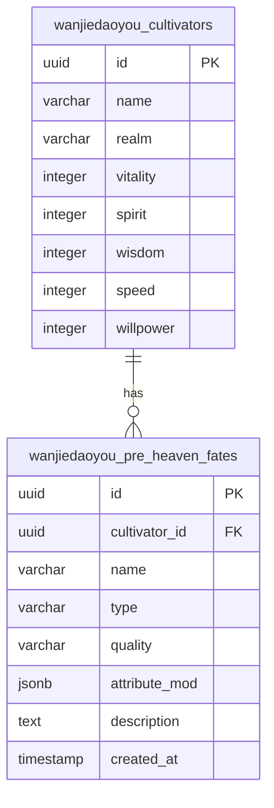
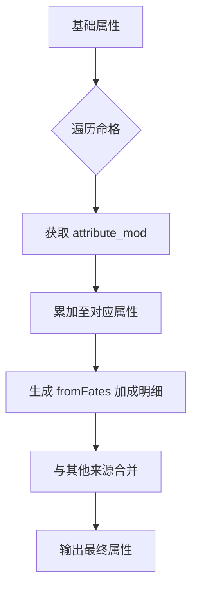
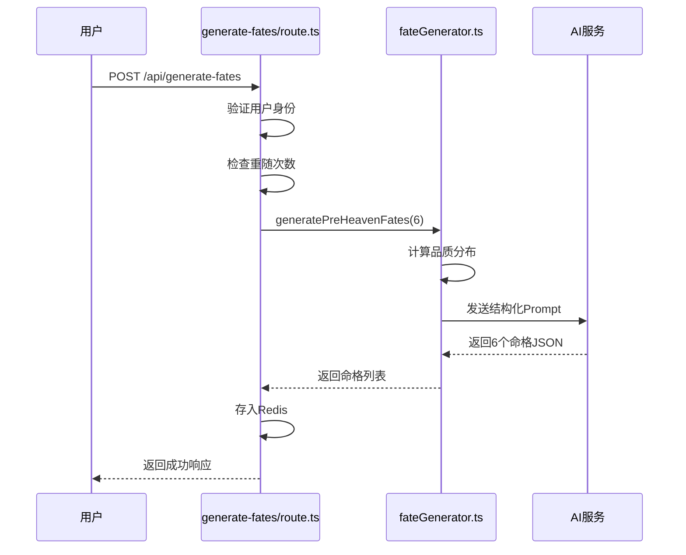

# 先天命格表 (preHeavenFates)

<cite>
**本文档引用文件**  
- [fateGenerator.ts](file://utils/fateGenerator.ts)
- [fateGenerator.test.ts](file://utils/fateGenerator.test.ts)
- [schema.ts](file://lib/drizzle/schema.ts)
- [cultivator.ts](file://types/cultivator.ts)
- [constants.ts](file://types/constants.ts)
- [generate-fates/route.ts](file://app/api/generate-fates/route.ts)
- [divine-fortune/route.ts](file://app/api/divine-fortune/route.ts)
- [divineFortune.ts](file://utils/divineFortune.ts)
- [useDivineFortune.ts](file://lib/hooks/useDivineFortune.ts)
- [cultivatorUtils.ts](file://utils/cultivatorUtils.ts)
- [page.tsx](file://app/create/page.tsx)
- [DivineFortune.tsx](file://components/welcome/DivineFortune.tsx)
</cite>

## 目录
1. [简介](#简介)
2. [数据库结构](#数据库结构)
3. [属性加成机制](#属性加成机制)
4. [命格生成逻辑](#命格生成逻辑)
5. [API接口与调用流程](#api接口与调用流程)
6. [前端交互与展示](#前端交互与展示)
7. [神签抽取联动机制](#神签抽取联动机制)
8. [总结](#总结)

## 简介
先天命格表（preHeavenFates）是修仙角色成长潜力的核心机制之一，用于定义角色在创建时所拥有的先天气运。该机制通过动态属性加成、吉凶类型与品质分级，构建了角色初始能力的多样性与策略性。命格由AI生成，结合随机分布与规则约束，确保平衡性与可玩性。

**Section sources**
- [fateGenerator.ts](file://utils/fateGenerator.ts#L1-L166)
- [schema.ts](file://lib/drizzle/schema.ts#L68-L80)

## 数据库结构
先天命格存储于 `wanjiedaoyou_pre_heaven_fates` 表中，采用关系型数据库设计，与角色主表（cultivators）形成一对多关联。

### 字段说明
| 字段名 | 类型 | 是否必填 | 说明 |
|--------|------|----------|------|
| id | UUID | 是 | 主键，自动生成 |
| cultivator_id | UUID | 是 | 外键，关联角色ID，删除时级联 |
| name | VARCHAR(100) | 是 | 命格名称，如“九阳圣体”、“厄运缠身” |
| type | VARCHAR(10) | 是 | 命格类型，仅限“吉”或“凶” |
| quality | VARCHAR(10) | 否 | 品质等级，从“凡品”到“神品”共8级 |
| attribute_mod | JSONB | 是 | 属性加成对象，支持动态扩展 |
| description | TEXT | 否 | 命格描述，包含来源、代价或触发条件 |
| created_at | TIMESTAMP | 否 | 创建时间，默认为当前时间 |

其中，`attribute_mod` 字段采用 JSONB 类型，允许灵活存储体魄、灵力、悟性、速度、神识五项基础属性的加成值，支持未来新增属性而无需修改表结构。



**Diagram sources**
- [schema.ts](file://lib/drizzle/schema.ts#L17-L80)

**Section sources**
- [schema.ts](file://lib/drizzle/schema.ts#L68-L80)
- [constants.ts](file://types/constants.ts#L115-L125)

## 属性加成机制
`attribute_mod` 字段采用 JSONB 结构设计，实现了对角色基础属性的动态加成，具备良好的扩展性与灵活性。

### JSONB 结构设计
```json
{
  "vitality": 15,
  "spirit": -10,
  "wisdom": 5
}
```
该结构支持以下特性：
- **可选字段**：仅记录有加成的属性，避免冗余。
- **正负值支持**：吉命格通常为正向加成，凶命格可包含负向惩罚。
- **未来扩展**：可新增如“luck”、“resistance”等属性，无需修改数据库模式。

### 属性加成计算
在角色属性计算过程中，先天命格的加成被纳入最终属性汇总。通过 `calculateFinalAttributes` 函数实现：



该机制确保命格加成与其他系统（如功法、装备）协同作用，形成完整的角色成长体系。

**Diagram sources**
- [cultivatorUtils.ts](file://utils/cultivatorUtils.ts#L51-L194)

**Section sources**
- [cultivator.ts](file://types/cultivator.ts#L64-L78)
- [cultivatorUtils.ts](file://utils/cultivatorUtils.ts#L51-L194)

## 命格生成逻辑
命格生成由 `fateGenerator.ts` 中的 `generatePreHeavenFates` 函数实现，结合概率分布与AI生成，确保多样性与平衡性。

### 品质分布算法
系统预设了8个品质等级及其出现概率：

| 品质 | 概率 | 加成范围 |
|------|------|---------|
| 凡品 | 30% | [-5, 5] |
| 灵品 | 30% | [4, 10] |
| 玄品 | 20% | [8, 15] |
| 真品 | 10% | [12, 20] |
| 地品 | 4% | [18, 30] |
| 天品 | 3% | [28, 45] |
| 仙品 | 2% | [40, 70] |
| 神品 | 1% | [60, 100] |

生成时，系统首先根据概率分布随机决定目标品质数量，再通过AI生成符合要求的命格。

### 生成流程


**Diagram sources**
- [fateGenerator.ts](file://utils/fateGenerator.ts#L94-L165)
- [generate-fates/route.ts](file://app/api/generate-fates/route.ts#L16-L68)

**Section sources**
- [fateGenerator.ts](file://utils/fateGenerator.ts#L1-L166)
- [constants.ts](file://types/constants.ts#L115-L125)

## API接口与调用流程
`/api/generate-fates` 接口负责命格生成，支持重随机制与临时存储。

### 请求参数
- `tempId`：临时角色ID，用于关联生成结果

### 响应结构
```json
{
  "success": true,
  "data": {
    "fates": [...],
    "remainingRerolls": 2
  }
}
```

### 限制机制
- 最多重随3次（MAX_REROLLS = 3）
- 使用Redis记录重随次数，防止滥用
- 生成结果临时存储于Redis，有效期1小时

此接口与角色创建流程紧密集成，确保用户体验流畅。

**Section sources**
- [generate-fates/route.ts](file://app/api/generate-fates/route.ts#L1-L68)
- [redisCultivatorRepository.ts](file://lib/repositories/redisCultivatorRepository.ts#L37-L54)

## 前端交互与展示
在角色创建页面（`create/page.tsx`），用户可查看并选择命格。

### 交互流程
1. 用户点击“逆天改命”按钮
2. 调用API生成6个命格
3. 展示命格列表，含名称、类型、品质、加成详情
4. 用户选择最多3个命格
5. 系统计算总属性修正值并实时显示

### 展示逻辑
- 吉命格显示🍀图标，凶命格显示😈图标
- 品质以徽章（InkBadge）形式标注
- 属性加成格式化为“体魄 +15，灵力 -10”等可读形式
- 已选命格标记“已取”标签

该设计提升了用户决策的直观性与沉浸感。

**Section sources**
- [page.tsx](file://app/create/page.tsx#L459-L520)
- [cultivatorUtils.ts](file://utils/cultivatorUtils.ts#L103-L111)

## 神签抽取联动机制
先天命格系统与神签抽取功能（divine-fortune）存在数据联动，共同构建修仙世界观。

### 神签功能说明
`/api/divine-fortune` 接口通过AI生成“今日天机”格言，用于欢迎页展示。

```mermaid
flowchart LR
A[前端] --> B[/api/divine-fortune]
B --> C{Redis缓存命中?}
C --> |是| D[返回缓存结果]
C --> |否| E[调用AI生成]
E --> F[存入Redis]
F --> G[返回结果]
```

### 联动设计
- **世界观统一**：两者均采用AI生成，风格一致（古风、宿命感）
- **数据降级**：AI失败时，命格有fallback机制，神签也有预设格言池
- **缓存策略**：神签结果缓存30分钟，避免频繁调用AI
- **前端复用**：`useDivineFortune` Hook封装了获取逻辑，支持错误降级

尽管两者功能独立，但共享AI调用模式与错误处理策略，体现了系统设计的一致性。

**Diagram sources**
- [divine-fortune/route.ts](file://app/api/divine-fortune/route.ts#L1-L55)
- [divineFortune.ts](file://utils/divineFortune.ts#L1-L132)

**Section sources**
- [divine-fortune/route.ts](file://app/api/divine-fortune/route.ts#L1-L55)
- [useDivineFortune.ts](file://lib/hooks/useDivineFortune.ts#L1-L44)
- [DivineFortune.tsx](file://components/welcome/DivineFortune.tsx#L1-L77)

## 总结
先天命格表作为角色成长的核心机制，通过JSONB结构实现了属性加成的灵活性与可扩展性。结合品质分级、吉凶类型与AI生成，构建了丰富多样的角色起点。生成流程受概率控制与重随限制，确保游戏平衡。前端展示清晰直观，支持用户决策。与神签系统的联动体现了世界观的统一与技术架构的一致性。整体设计兼顾了技术可行性、游戏性与用户体验。