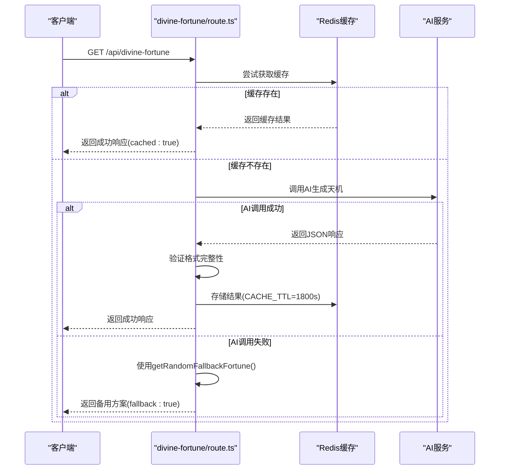
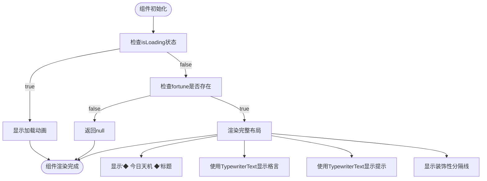
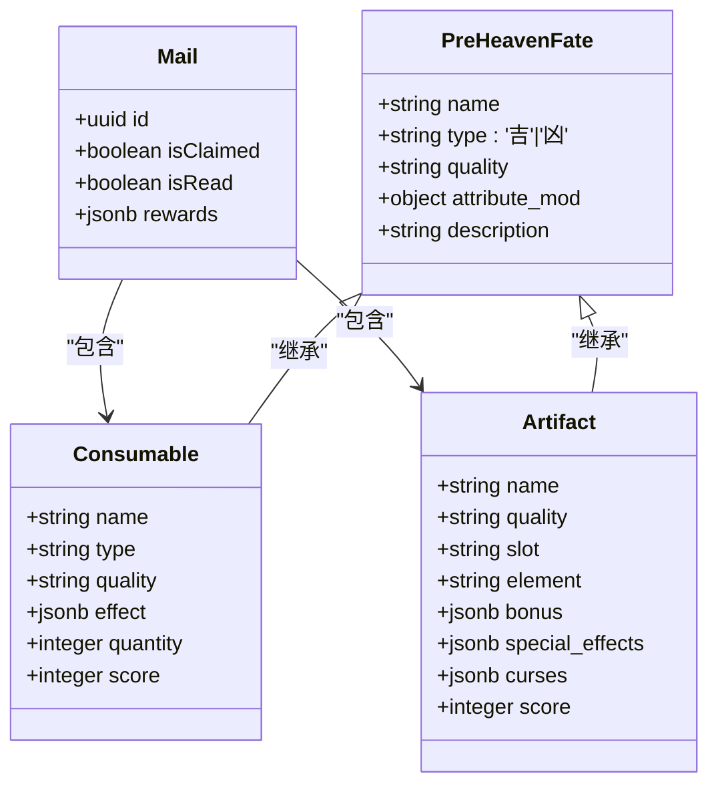
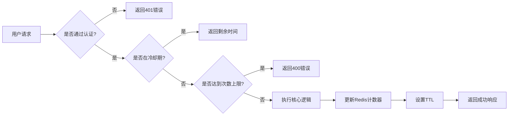

# 神签抽取

<cite>
**本文档引用的文件**  
- [divine-fortune/route.ts](file://app/api/divine-fortune/route.ts)
- [divineFortune.ts](file://utils/divineFortune.ts)
- [DivineFortune.tsx](file://components/welcome/DivineFortune.tsx)
- [useDivineFortune.ts](file://lib/hooks/useDivineFortune.ts)
- [TypewriterText.tsx](file://components/welcome/TypewriterText.tsx)
- [index.ts](file://lib/redis/index.ts)
- [redisCultivatorRepository.ts](file://lib/repositories/redisCultivatorRepository.ts)
- [fateGenerator.ts](file://utils/fateGenerator.ts)
- [rankings.ts](file://lib/redis/rankings.ts)
</cite>

## 目录
1. [简介](#简介)
2. [核心功能分析](#核心功能分析)
3. [API认证与流程控制](#api认证与流程控制)
4. [前端动画与交互设计](#前端动画与交互设计)
5. [签文类型与奖励系统](#签文类型与奖励系统)
6. [AI动态描述集成](#ai动态描述集成)
7. [安全限流与防刷策略](#安全限流与防刷策略)
8. [用户体验优化建议](#用户体验优化建议)
9. [结论](#结论)

## 简介
神签抽取功能是修仙世界观下的一项核心互动机制，通过AIGC技术生成富有哲理的"今日天机"格言，为玩家提供修行指引。该功能融合了后端API服务、Redis缓存、AI内容生成、前端动画展示等多个技术模块，形成了完整的用户体验闭环。系统具备降级容错机制，在AI服务不可用时可自动切换至预设的备用格言池，确保功能的高可用性。

## 核心功能分析

神签抽取功能的核心在于`divineFortune.ts`中的抽取逻辑与奖励计算。该模块定义了`DivineFortune`接口，包含`fortune`（天机格言）和`hint`（道家提示）两个字段，构成了签文的基本结构。系统通过`getDivineFortunePrompt`函数生成AI调用的提示词，遵循严格的格式要求：格言部分10-20字，古风哲理；提示部分8-15字，采用"宜/忌"格式。备用格言池`FALLBACK_FORTUNES`包含了20条预设的道家经典语录，作为AI生成失败时的降级方案。

**本节来源**  
- [divineFortune.ts](file://utils/divineFortune.ts#L5-L131)

## API认证与流程控制

`divine-fortune/route.ts`API实现了完整的认证校验、冷却时间控制与结果持久化流程。API采用Next.js的路由处理机制，通过`redis`实例实现缓存管理。系统设置了30分钟的缓存有效期（`CACHE_TTL`），有效减轻AI服务的调用压力。认证流程依赖Supabase的用户系统，确保只有授权用户才能访问服务。

流程控制方面，API首先尝试从Redis获取缓存结果，若存在则直接返回，标记`cached: true`。若缓存未命中，则调用AI服务生成新的天机格言。系统实现了双重降级策略：AI响应解析失败时使用备用格言，整个服务异常时也返回备用方案并标记`fallback: true`。结果持久化通过`redis.set`实现，确保后续请求能在缓存有效期内直接获取结果。

**图示来源**  
- [divine-fortune/route.ts](file://app/api/divine-fortune/route.ts#L18-L80)
- [divineFortune.ts](file://utils/divineFortune.ts#L128-L131)

**本节来源**  
- [divine-fortune/route.ts](file://app/api/divine-fortune/route.ts#L1-L80)
- [index.ts](file://lib/redis/index.ts#L1-L5)

## 前端动画与交互设计

`DivineFortune.tsx`组件实现了精美的前端动画交互设计，包括签筒摇动效果、签文浮现过渡与结果展示布局。组件采用React的客户端渲染模式（'use client'），通过`useDivineFortune`Hook获取天机数据。在加载状态显示"正在推演天机……"的脉冲动画，使用`animate-pulse`CSS类实现。

签文浮现采用打字机效果，由`TypewriterText`组件实现。该组件通过`useTypewriter`Hook控制文本逐字显示，支持自定义速度（`speed`）、延迟（`startDelay`）和启用控制（`enabled`）。天机格言和提示信息的显示有精确的时间控制：提示信息的开始延迟为格言长度×100ms+300ms，确保视觉上的连贯性。组件布局采用居中设计，包含装饰性的分隔线和道教符号"☯"，营造出浓厚的修仙氛围。

**图示来源**  
- [DivineFortune.tsx](file://components/welcome/DivineFortune.tsx#L18-L76)
- [TypewriterText.tsx](file://components/welcome/TypewriterText.tsx#L16-L50)

**本节来源**  
- [DivineFortune.tsx](file://components/welcome/DivineFortune.tsx#L1-L76)
- [useDivineFortune.ts](file://lib/hooks/useDivineFortune.ts#L9-L44)

## 签文类型与奖励系统

系统实现了完整的签文类型分类与奖励物品掉落表配置。签文类型主要分为"吉"、"凶"、"平"三类，在`fateGenerator.ts`中通过Zod模式定义了`PreHeavenFateSchema`，其中`type`字段明确限定为['吉', '凶']。在UI展示中，"吉"签使用"🍀"符号，"凶"签使用"😈"符号，通过`create/page.tsx`中的条件渲染实现。

奖励系统采用品质分级机制，包含凡品、灵品、玄品、真品、地品、天品、仙品、神品八个等级。属性加成通过`attribute_mod`对象配置，支持体魄、灵力、悟性、速度、神识五维属性的±100范围内调整。数据库设计中，`consumables`表和`artifacts`表均包含`quality`字段，实现了奖励物品的统一品质管理。邮件系统中的奖励领取流程通过事务处理确保数据一致性，支持消耗品的堆叠和法宝的独立存储。

**图示来源**  
- [fateGenerator.ts](file://utils/fateGenerator.ts#L31-L49)
- [schema.ts](file://lib/drizzle/schema.ts#L158-L173)
- [route.ts](file://app/api/mail/[id]/claim/route.ts#L113-L153)

**本节来源**  
- [fateGenerator.ts](file://utils/fateGenerator.ts#L31-L69)
- [create/page.tsx](file://app/create/page.tsx#L475-L526)
- [schema.ts](file://lib/drizzle/schema.ts#L158-L173)

## AI动态描述集成

系统通过`aiClient.ts`实现了基于AI的动态描述生成集成。`getDivineFortunePrompt`函数构建了精心设计的系统提示词（systemPrompt）和用户提示词（userPrompt），引导AI生成符合修仙世界观的天机格言。系统提示词明确规定了输出格式为纯JSON，包含`fortune`和`hint`字段，并提供了示例。内容要求玄妙、优雅、有意境，禁止使用现代词汇。

AI调用通过`object`函数实现，使用Zod模式验证响应格式，确保`fortune`和`hint`字段均存在且非空。这种结构化输出方式避免了自由文本生成的不可预测性，提高了系统的稳定性和可维护性。当AI服务不可用或响应格式错误时，系统自动降级到本地的`FALLBACK_FORTUNES`池，体现了良好的容错设计。

**本节来源**  
- [divineFortune.ts](file://utils/divineFortune.ts#L13-L37)
- [divine-fortune/route.ts](file://app/api/divine-fortune/route.ts#L33-L45)

## 安全限流与防刷策略

系统实施了多层次的安全限流与防刷策略，主要基于Redis实现。`redisCultivatorRepository.ts`中的`checkAndIncrementReroll`函数实现了重随次数限制，通过`REROLL_COUNT_PREFIX`前缀的计数器跟踪每个临时角色的重随次数，最多允许3次。计数器与临时角色数据共享1小时的TTL，确保数据的及时清理。

更复杂的限流机制体现在排行榜系统中，`rankings.ts`实现了每日挑战次数限制（`MAX_DAILY_CHALLENGES`）。通过`DAILY_CHALLENGES_PREFIX`+`cultivatorId`+`today`的键模式，记录每个玩家每天的挑战次数，TTL设置为到午夜的剩余秒数，实现自然的每日重置。系统还实现了分布式锁机制（`acquireChallengeLock`），使用Redis的SET NX EX命令防止并发挑战导致的数据竞争。

**图示来源**  
- [redisCultivatorRepository.ts](file://lib/repositories/redisCultivatorRepository.ts#L60-L90)
- [rankings.ts](file://lib/redis/rankings.ts#L276-L287)
- [rankings.ts](file://lib/redis/rankings.ts#L346-L360)

**本节来源**  
- [redisCultivatorRepository.ts](file://lib/repositories/redisCultivatorRepository.ts#L60-L90)
- [rankings.ts](file://lib/redis/rankings.ts#L276-L380)
- [generate-fates/route.ts](file://app/api/generate-fates/route.ts#L36-L45)

## 用户体验优化建议

基于系统分析，提出以下用户体验优化建议：

1. **预加载动画优化**：当前加载状态仅显示静态文本，建议增加签筒摇动的SVG动画，配合轻微的晃动效果，增强沉浸感。

2. **结果分享功能**：可增加"分享今日天机"按钮，将签文内容生成为精美的图片卡片，包含游戏LOGO和分享二维码，促进社交传播。

3. **历史记录功能**：在Redis中增加`divine_fortune_history`键，存储用户最近7天的天机记录，允许用户回顾历史签文。

4. **个性化推荐**：根据用户的角色境界、功法类型等特征，调整AI提示词中的上下文信息，生成更具个性化的修行建议。

5. **离线支持**：加强本地备用格言池的管理，当网络不可用时，可从备用池中随机选择并记录已使用过的格言，避免重复。

6. **无障碍访问**：为打字机效果增加开关选项，允许对动画敏感的用户关闭逐字显示效果，提升可访问性。

## 结论
神签抽取功能通过前后端协同设计，实现了从AI内容生成到前端动画展示的完整闭环。系统架构合理，具备良好的容错性和扩展性。Redis缓存和限流机制确保了服务的高可用性，而多层次的降级策略保障了极端情况下的用户体验。未来可进一步优化个性化推荐算法和社交分享功能，提升用户参与度和留存率。